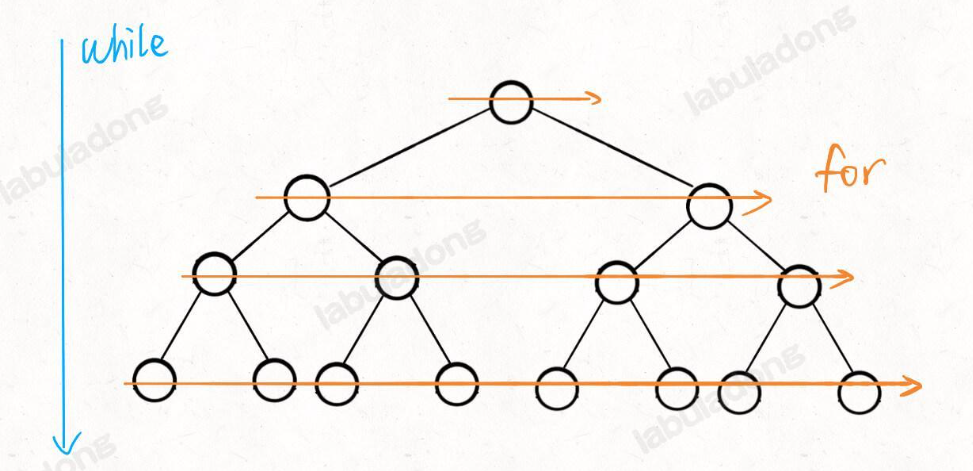

# 二叉树笔记

二叉树遍历思想：前中后序
- 快速排序是二叉树的前序遍历
- 归并排序是二叉树的后序遍历

```python
# 快速排序
def quicksort(nums:list[int], left:int, right:int):
    #### 前序位置 ####
    # 通过交换元素构造/寻找分界点，partition实现功能
    p = partition(nums, left, right)

    # 左边子数组
    quicksort(nums, left, p-1)
    # 右边子数组
    quicksort(nums, p+1, right)

# 归并排序
def mergesort(nums:list[int], left:int, right:int):
    mid = (left+right) // 2
    # 左边子数组
    mergesort(nums, left, mid)
    # 右边子数组
    mergesort(nums, mid+1, right)

    #### 后序位置 ####
    # 合并子数组
    merge(nums, left, mid, right)

# 二叉树遍历框架（递归形式）
# traverse 函数作用就是便利二叉树所有节点
def traverse(root):
    if root is None:
        return
    # 前序位置
    traverse(root.left)
    # 中序位置
    traverse(root.right)
    # 后序位置
```

**前中后序是遍历二叉树过程中处理每一个节点的三个特殊时间点**
1.前序位置的代码在刚刚进入一个二叉树节点的时候执行
2.后序位置的代码在将要离开一个二叉树节点的时候执行
3.中序位置的代码在一个二叉树节点左子树都遍历完，即将开始遍历右子树的时候执行

**重点**
二叉树的所有问题，就是让你在前中后序位置注入巧妙的代码逻辑，去达到自己的目的
只需要单独思考每一个节点应该做什么，其他的不用你管，抛给二叉树遍历框架，递归会在所有节点上做相同的操作

**二叉树解题的思维模式**
【遍历】
1. 是否可以通过遍历一遍二叉树得到答案
2. 如果可以，用一个traverse函数配合外部变量实现

【递归】
1. 是否可以通过子问题（子树）的答案推导出原问题的答案?
2. 如果可以，定义一个递归函数，写出这个递归函数的定义，并充分利用这个函数的返回值

**思考**
如果单独抽出一个二叉树节点，它需要做什么事情？需要在什么时候（前/中/后序位置）做？
其他的节点不用你操心，递归函数会帮你在所有节点上执行相同的操作。

## 后序位置的特殊之处

中序位置主要用在 BST 场景中
前序位置本身其实没有什么特别的性质

**前序位置的代码只能从函数参数中获取父节点传递来的数据，而后序位置的代码不仅可以获取参数数据，还可以获取到子树通过函数返回值传递回来的数据**

举具体的例子，有一棵二叉树，问：
1. 如果把根节点看做第 1 层，如何打印出每一个节点所在的层数？
2. 如何打印出每个节点的左右子树各有多少节点？

**这两个问题的根本区别在于：一个节点在第几层，你从根节点遍历过来的过程就能顺带记录，用递归函数的参数就能传递下去；而以一个节点为根的整棵子树有多少个节点，你需要遍历完子树之后才能数清楚，然后通过递归函数的返回值拿到答案。**

**总结**
一旦发现题目和**子树**有关，那大概率要给函数设置合理的定义和返回值，在**后序位置**写代码了。

## 从树的视角看待动态规划/回溯/DFS算法的区别和联系

动归/DFS/回溯算法都可以看做二叉树问题的扩展，只是它们的关注点不同：

- 动态规划算法属于分解问题的思路，它的关注点在整棵「子树」。
- 回溯算法属于遍历的思路，它的关注点在节点间的「树枝」。
- DFS 算法属于遍历的思路，它的关注点在单个「节点」。


**第一个例子**：给你一棵二叉树，请你用分解问题的思路写一个 count 函数，计算这棵二叉树共有多少个节点。
```python
#定义：输入一棵二叉树，返回这棵二叉树的节点总数
def count(root):
    if not root:
        return 0
    # root这个节点关心的是两个子树的节点总数分别是多少
    leftCount = count(root.left)
    rightCount = count(root.right)
    # 后序位置，左右子树节点数加上自己就是整棵树的节点数
    return leftCount + rightCount + 1
```

这就是动态规划分解问题的思路，它的着眼点永远是结构相同的整个子问题，类比到二叉树上就是「子树」。

**第二个例子**：给你一棵二叉树，请你用遍历的思路写一个 traverse 函数，打印出遍历这棵二叉树的过程
```python
# 二叉树
def traverse(root: TreeNode) -> None:
    if root is None:
        return
    print("从节点 %s 进入节点 %s" % (root, root.left))
    traverse(root.left)
    print("从节点 %s 回到节点 %s" % (root.left, root))

    print("从节点 %s 进入节点 %s" % (root, root.right))
    traverse(root.right)
    print("从节点 %s 回到节点 %s" % (root.right, root))

# 多叉树
def traverse(root: Node) -> None:
    if root is None:
        return
    for child in root.children:
        print(f"从节点 {root} 进入节点 {child}")
        traverse(child)
        print(f"从节点 {child} 回到节点 {root}")

# 回溯算法框架
def backtrack(...) -> None:
    for i in list:
        # 做选择
        ...

        # 进入下一层决策树
        backtrack(...)

        # 撤销做的选择
        ...

```

**第三个例子**：一棵二叉树，请你写一个 traverse 函数，把这棵二叉树上的每个节点的值都加一。
```python
def traverse(root):
    if root is None:
        return
    # 遍历过的每个节点的值加一
    root.val += 1
    traverse(root.left)
    traverse(root.right)
```
这就是 DFS 算法遍历的思路，它的着眼点永远是在单一的节点上，类比到二叉树上就是处理每个「节点」。

综上，回溯算法和 DFS 算法代码中「做选择」和「撤销选择」的位置不同了，看下面两段代码：
```python
# DFS 算法把「做选择」「撤销选择」的逻辑放在 for 循环外面
def dfs(root: 'Node'):
    if not root: return
    # 做选择
    print("我已经进入节点 %s 啦" % root.value)
    for child in root.children:
        dfs(child)
    # 撤销选择
    print("我将要离开节点 %s 啦" % root.value)

# 回溯算法把「做选择」「撤销选择」的逻辑放在 for 循环里面
def backtrack(root: 'Node'):
    if not root: return
    for child in root.children:
        # 做选择
        print("我站在节点 %s 到节点 %s 的树枝上" % (root.value, child.value))
        backtrack(child)
        # 撤销选择
        print("我将要离开节点 %s 到节点 %s 的树枝上" % (child.value, root.value))
```

## 层序遍历
```python
# 队列数据结构
from collections import deque
queue = deque(["Eric", "John", "Michael"])
queue.append("Terry")
queue.append("Graham")
queue.popleft()
# 'Eric'
queue.popleft()
# 'John'
queue
# deque(['Michael', 'Terry', 'Graham'])

# 输入一棵二叉树的根节点，层序遍历这棵二叉树
def levelTraverse(root: TreeNode):
    if not root:
        return
    
    q = deque()
    q.append(root)

    # 从上到下遍历二叉树的每一层
    while q:
        sz = len(q)
        # 从左到右遍历每一层的每个节点
        for i in range(sz):
            cur = q.popleft()
            # 将下一层节点放入队列
            if cur.left:
                q.append(cur.left)
            if cur.right:
                q.append(cur.right)

```


